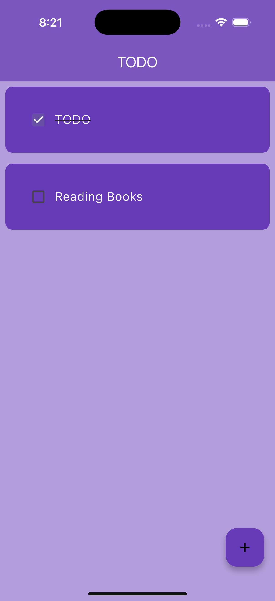
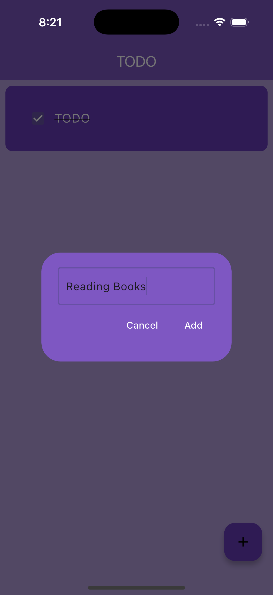
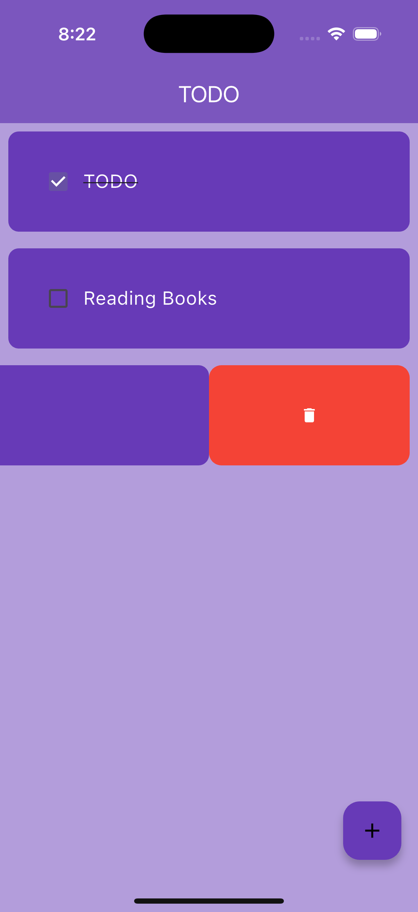

# Flutter To-Do App

A clean, minimal to-do list built with **Flutter**. Add tasks, check/uncheck them, and swipe to delete. This repo is a starter you can extend with persistence, filtering, and theming.

## Screenshots

<p align="center">
  
  
  
</p>

## Features
- Create tasks via input dialog
- Toggle completion (checkbox + strikethrough)
- Swipe-to-delete with confirm affordance
- Material design, responsive layout

## Getting Started

### Prereqs
- Flutter (stable channel)
- Android Studio (or VS Code) with Flutter/Dart plugins
- A device or emulator

### Run
```bash
flutter pub get
flutter run
